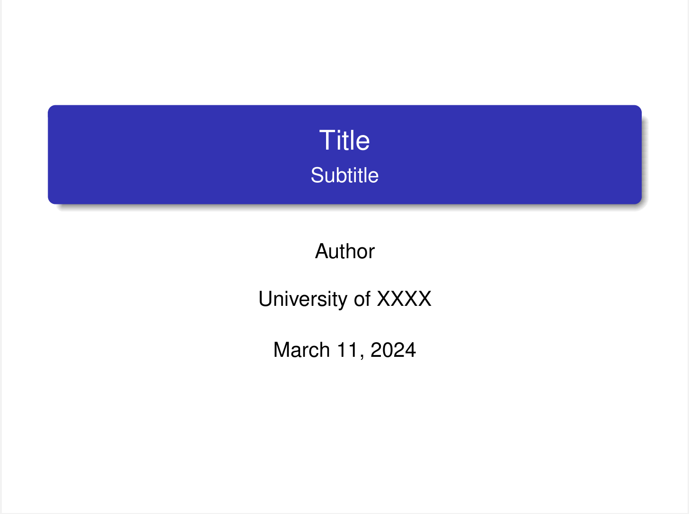
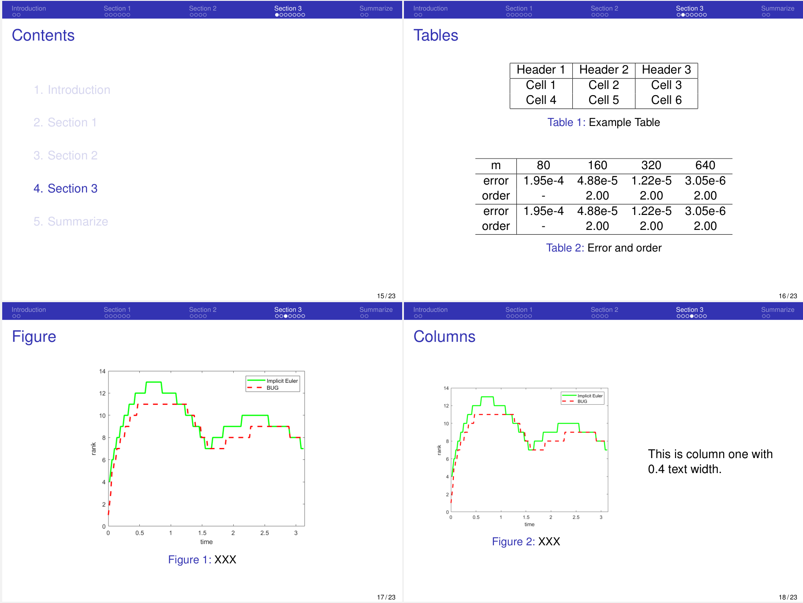

# README

## 一个简单干净的Beamer汇报模板

特点如下：

- 默认支持英文，导入ctex宏包即可支持中文；
- 没有使用任何的背景图片和学校标志等；
- 背景纯白色，主题色为蓝色，看起来很干净清爽，拒绝花里胡哨；
- 导航栏在顶部，移除了页面底部导航栏和导航按钮，在底部添加了页码显示；
- 字体方面：
    - 正文的英文字体使用了palatino字体，看起来比默认字体更粗更圆润；
    - 没有使用自定义中文字体；
- 宏包支持：
    - 使用subcaption宏包支持并列多图；
    - 使用biblatex宏包支持参考文献，不使用参考文献时需要注释掉`\addbibresource{reference.bib}`，否则编译错误；
    - 使用algorithm2e支持算法环境；
    - 使用listings宏包支持代码环境。

## A Simple Beamer Presentation Template

Features:

- Default support for English; importing the ctex package enables support for Chinese.
- No use of background images, school logos, etc.
- Clean and crisp design with a pure white background and a blue color theme, avoiding unnecessary embellishments.
- Top navigation bar; removal of the bottom navigation bar and navigation buttons, with page numbers added at the bottom.
- Fonts:
    - Palatino font used for English text, providing a bolder and more rounded appearance than the default font.
    - No custom Chinese fonts used.
- Package support:
    - Use subcaption for handling side-by-side figures.
    - Use biblatex package for bibliography support. Comment out `\addbibresource{reference.bib}` if no bibliography is used to avoid compilation errors.
    - Use algorithm2e for algorithm environments.
    - Use listings for code environments.

